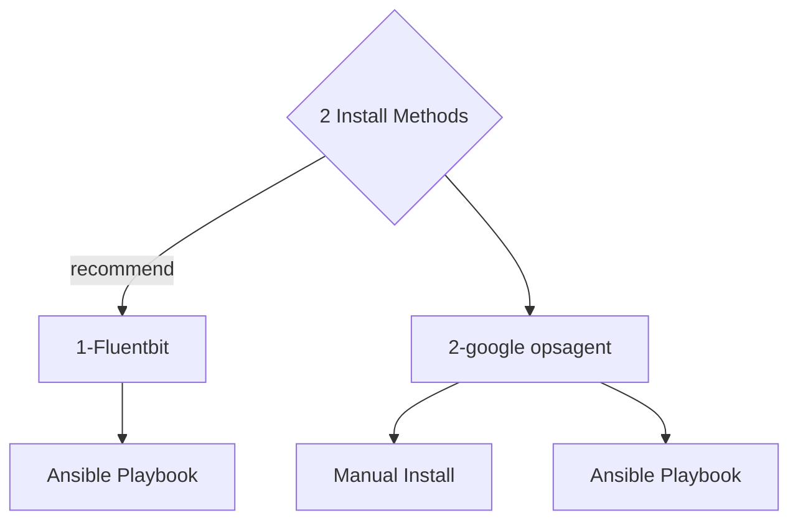

# 2 methods to ingest log into google cloud logging from aws or on-premise machines.




# Method1: ansible playbook: fluent bit + stack driver output on amazon linux 2 or centos

## method 1-1: ansible on amazon linux 2

prepare your service account json file and run ansible playbook

```
ansible-playbook -i hosts -u ec2-user --private-key ~/.ssh/argolis.pem  fluentbit.yaml
```


test the json log into cloud logging
```
echo '{"key1": "12345", "key2": "abc", "time": "2006-07-28T15:22:04Z"}' >> /tmp/1.log
```

```
[SERVICE]
    # Flush
    # =====
    # set an interval of seconds before to flush records to a destination
    flush        1

    # Daemon
    # ======
    # instruct Fluent Bit to run in foreground or background mode.
    daemon       Off

    # Log_Level
    # =========
    # Set the verbosity level of the service, values can be:
    #
    # - error
    # - warning
    # - info
    # - debug
    # - trace
    #
    # by default 'info' is set, that means it includes 'error' and 'warning'.
    log_level   debug
    log_file /home/centos/fluentbit.log

    # Parsers File
    # ============
    # specify an optional 'Parsers' configuration file
    parsers_file parsers.conf

    # Plugins File
    # ============
    # specify an optional 'Plugins' configuration file to load external plugins.
    plugins_file plugins.conf

    # HTTP Server
    # ===========
    # Enable/Disable the built-in HTTP Server for metrics
    http_server  Off
    http_listen  0.0.0.0
    http_port    2020

    # Storage
    # =======
    # Fluent Bit can use memory and filesystem buffering based mechanisms
    #
    # - https://docs.fluentbit.io/manual/administration/buffering-and-storage
    #
    # storage metrics
    # ---------------
    # publish storage pipeline metrics in '/api/v1/storage'. The metrics are
    # exported only if the 'http_server' option is enabled.
    #
    storage.metrics on

    # storage.path
    # ------------
    # absolute file system path to store filesystem data buffers (chunks).
    #
    storage.path /tmp/storage

    # storage.sync
    # ------------
    # configure the synchronization mode used to store the data into the
    # filesystem. It can take the values normal or full.
    #
    # storage.sync normal

    # storage.checksum
    # ----------------
    # enable the data integrity check when writing and reading data from the
    # filesystem. The storage layer uses the CRC32 algorithm.
    #
    # storage.checksum off

    # storage.backlog.mem_limit
    # -------------------------
    # if storage.path is set, Fluent Bit will look for data chunks that were
    # not delivered and are still in the storage layer, these are called
    # backlog data. This option configure a hint of maximum value of memory
    # to use when processing these records.
    #
    # storage.backlog.mem_limit 5M

[INPUT]
    name cpu
    tag  cpu.local

    # Read interval (sec) Default: 1
    interval_sec 1

[OUTPUT]
    name  stdout
    match *
# BEGIN ANSIBLE MANAGED BLOCK
[INPUT]
    Buffer_Chunk_Size 512k
    Buffer_Max_Size   5M
    DB          /home/centos/default_pipeline_syslog
    name        tail
    path        /tmp/*.log
    parser      json
    tag         cliu-fluentbit-2
    Read_from_Head    True
    Rotate_Wait       30
    Skip_Long_Lines   On
    storage.type      filesystem
[OUTPUT]
    Name        stackdriver
    Match       cliu-fluentbit-2
    google_service_credentials    /etc/google/auth/application_default_credentials.json
    resource    global
```

## method 1-2: ansible on centos 7


```
ansible-playbook -i hosts -u centos --private-key ~/.ssh/argolis.pem  fluentbit-centos.yaml
```


# Method2: opsagent-on-aws

## method 2-1: manual steps

1. download the google cloud ops agent repo
```
curl -sSO https://dl.google.com/cloudagents/add-google-cloud-ops-agent-repo.sh
```

2. install the google cloud ops-agent repo and package
```
echo "amazon linux 2" > /etc/redhat-release   # only for amazon linux since the file is not existed :(
sudo bash add-google-cloud-ops-agent-repo.sh
sudo yum install google-cloud-ops-agent
```

3. copy the service account json file into ec2's "/etc/google/auth/application_default_credentials.json"

4. override the systemd config file with this command
```
systemctl edit google-cloud-ops-agent-fluent-bit.service
```

```
[Service]
Environment='GOOGLE_SERVICE_CREDENTIALS=/etc/google/auth/application_default_credentials.json'
```

5. config the ops agent fluent bit service
```
logging:
  receivers:
    cliu-test-1:
      type: files

      include_paths: [/tmp/*.log]
      exclude_paths: [/tmp/not-this-one.log]

  processors:
    cliu-json-log:
      type: parse_json

  service:
    pipelines:
      default_pipeline:
        receivers:
        - cliu-test-1
        processors:
        - cliu-json-log
```


6. restart the ops agent service and echo json log to test the result
```
systemctl restart google-cloud-ops-agent-fluent-bit.service
echo '{"key1": "value1", "key2": "value2","key3": "value3","key4": "value4"}' >> /tmp/amz3.log
```


## method 2-2: ansible script

1. pre-requirement:   
```
echo "amazon linux 2" > /etc/redhat-release   # only for amazon linux since the file is not existed :(
```

2. prepare your service account json file and run ansible playbook
```
# for amazone linux
ansible-playbook -i hosts -u ec2-user --private-key ~/.ssh/argolis.pem  opsagent.yaml

# for centos linux
ansible-playbook -i hosts -u centos --private-key ~/.ssh/argolis.pem  opsagent.yaml
```

# create pubsub topic and pull subscription

```
gcloud pubsub topics create my-topic

gcloud pubsub subscriptions create my-topic-sub \
  --topic=my-topic 
```

# create the cloud logging sink into pub&sub

```
gcloud logging sinks create my-pubsub-sink pubsub.googleapis.com/projects/cliu201/topics/my-topic \
  --log-filter='logName=("projects/cliu201/logs/cliu-fluentbit-2" OR "projects/cliu201/logs/cliu-fluentbit-1")'

gcloud logging sinks describe my-pubsub-sink

createTime: '2022-08-11T05:44:36.930113047Z'
destination: pubsub.googleapis.com/projects/cliu201/topics/my-topic
filter: logName=("projects/cliu201/logs/cliu-fluentbit-2" OR "projects/cliu201/logs/cliu-fluentbit-1")
name: my-pubsub-sink
updateTime: '2022-08-11T05:44:36.930113047Z'
writerIdentity: serviceAccount:p148965607901-821399@gcp-sa-logging.iam.gserviceaccount.com
```

# give this writer identity the pubsub publisher permission

