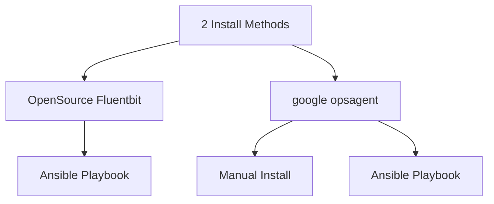

# 2 methods to ingest log into google cloud logging from aws or on-premise machines.




# Method1: ansible playbook: fluent bit + stack driver output on amazon linux 2

prepare your service account json file and run ansible playbook

```
ansible-playbook -i hosts -u ec2-user --private-key ~/.ssh/argolis.pem  fluentbit.yaml
```


# Method2: opsagent-on-aws

## method 2-1: manual steps

1. download the google cloud ops agent repo
```
curl -sSO https://dl.google.com/cloudagents/add-google-cloud-ops-agent-repo.sh
```

2. install the google cloud ops-agent repo and package
```
echo "amazon linux 2" > /etc/redhat-release   # only for amazon linux since the file is not existed :(
sudo bash add-google-cloud-ops-agent-repo.sh
sudo yum install google-cloud-ops-agent
```

3. copy the service account json file into ec2's "/etc/google/auth/application_default_credentials.json"

4. override the systemd config file with this command
```
systemctl edit google-cloud-ops-agent-fluent-bit.service
```

```
[Service]
Environment='GOOGLE_SERVICE_CREDENTIALS=/etc/google/auth/application_default_credentials.json'
```

5. config the ops agent fluent bit service
```
logging:
  receivers:
    cliu-test-1:
      type: files

      include_paths: [/tmp/*.log]
      exclude_paths: [/tmp/not-this-one.log]

  processors:
    cliu-json-log:
      type: parse_json

  service:
    pipelines:
      default_pipeline:
        receivers:
        - cliu-test-1
        processors:
        - cliu-json-log
```


6. restart the ops agent service and echo json log to test the result
```
systemctl restart google-cloud-ops-agent-fluent-bit.service
echo '{"key1": "value1", "key2": "value2","key3": "value3","key4": "value4"}' >> /tmp/amz3.log
```


## method 2-2: ansible script

1. pre-requirement:   
```
echo "amazon linux 2" > /etc/redhat-release   # only for amazon linux since the file is not existed :(
```

2. prepare your service account json file and run ansible playbook
```
# for amazone linux
ansible-playbook -i hosts -u ec2-user --private-key ~/.ssh/argolis.pem  opsagent.yaml

# for centos linux
ansible-playbook -i hosts -u centos --private-key ~/.ssh/argolis.pem  opsagent.yaml
```